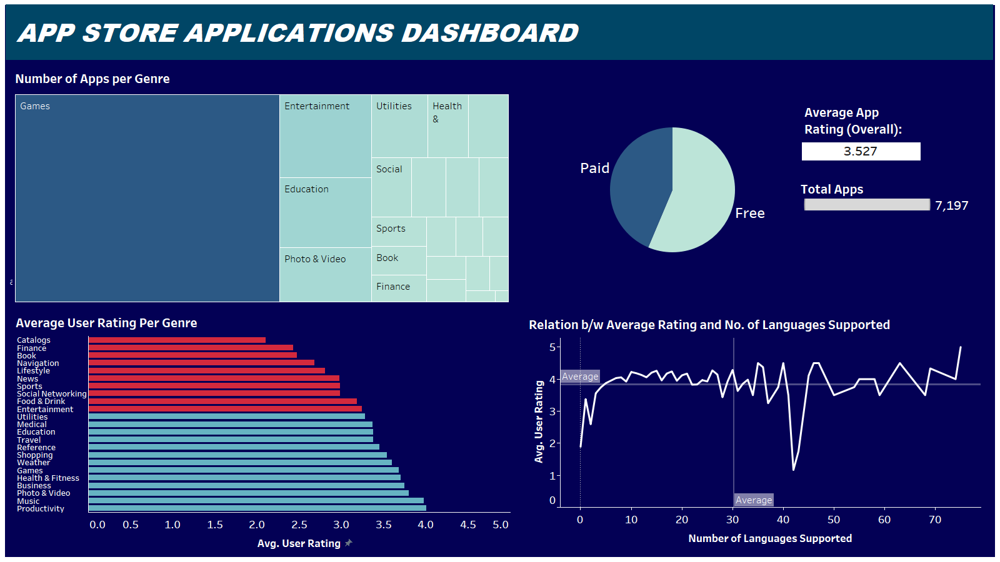
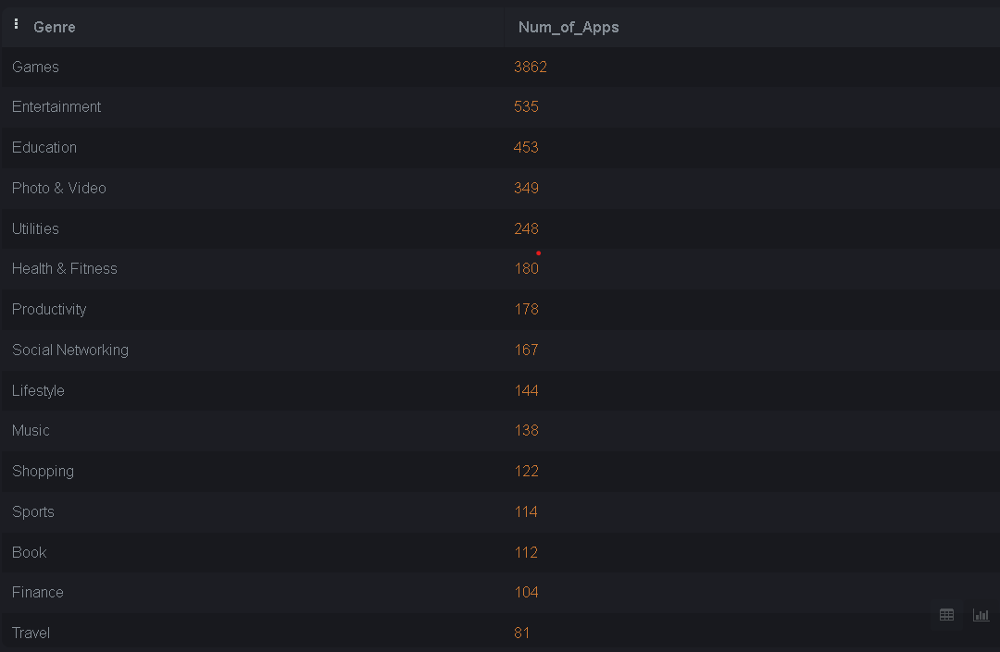
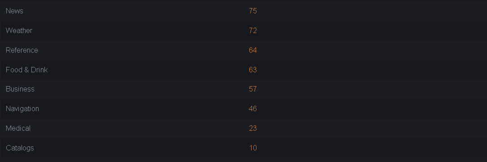
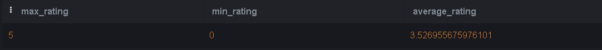
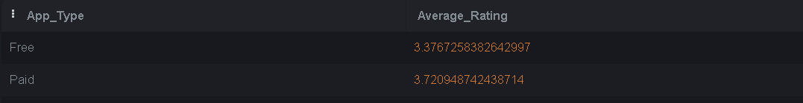
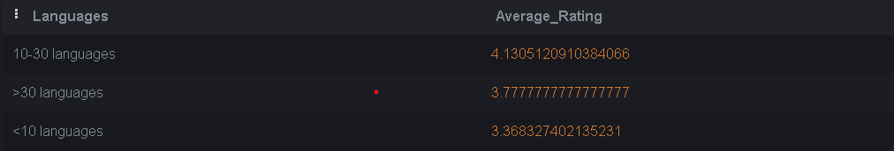
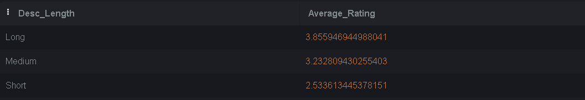
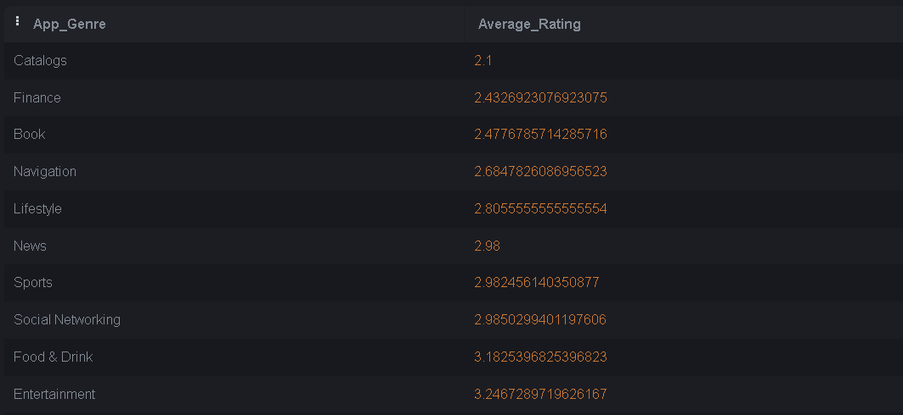

# SQL Project on Analysis of Key Metrics related to Apps available on App Store

1) This project puts to use a series of SQL queries to reveal some important Data related knowledge that might be useful for some potential Developer client who might be interested in launching a new product or expanding its current portfolio of Applications.

2) It reveals insights on some important factors such as-

   a) Genre Saturation

   b) User Ratings on Apps

   c) Impact on Ratings if Apps are either paid or free

   d) Impact on Ratings depending on Language Support of Apps

   e) Genres with least rated apps

   f) Top Applications in each Genre etc.

3) The Dashboard:

   

   
4) On the basis of the Outcomes and Observations, the following Recommendations can be made:

   a) From query for apps per genre -

   It is found that there's a high degree of saturation in genres like Gaming, Education, Entertainment etc. Thus it would be difficult to launch another product in them. Despite quality, there's a chance that the application might not gain traction due to high competetiveness.

   Instead the Developer could target low saturated genres like Navigation and Business.

   
   

   b) From query for User Ratings (Max, Min, and Average) -

   The average app rating across all apps is ~3.52, thus the developer should target to reach a minimum threshold of this value.

   

   c) For query on relation between paid/free apps and user rating -

   It is found that paid apps have slightly higher rating than free ones. This might indicate higher degree of trust from customers in services they actually have to pay for one-time or in the form of a subscription. Thus the developer might consider charging some amount of fee for the application and its services.

   

   d) For query about language supports -

   An interesting outcome in relation to the language support has been found. While apps with higher language support in general have higher user-rating, but the number of languages need not be very high.

   Instead, a bracket of 10-30 languages has peak ratings, indicating that specific languages with large population base using them, should be targeted to improve the accessibilty of the app to maximum users.

   

   e) For query about description length and associated user ratings - 

   A direct relation between the description length and user ratings can be seen. Thus, users usually prefer detailed and comprehensive decription about the App, its features, its capabilities and support. 

   

   f) For query about Genres with lowest rated apps -

   The developer could target these genres which have low average ratings for apps. There's higher potential to have a more succesful launch in these categories due to slightly lower level of existing competition.

   
